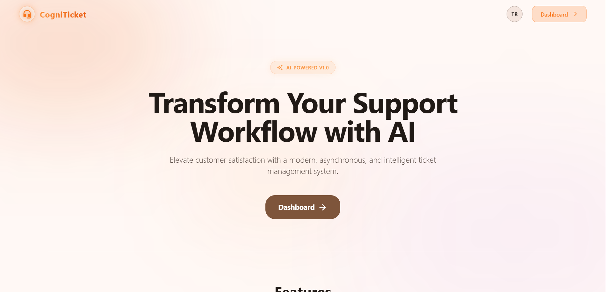
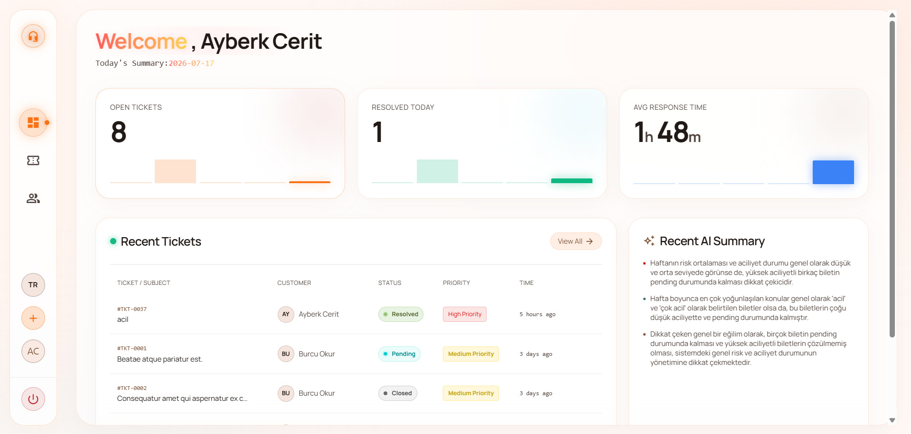
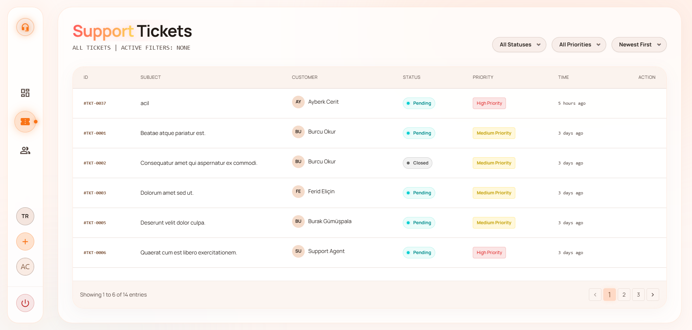

<div align="right">
  <a href="README.tr.md"></a>
</div>

<div align="center">
  
  
  <h1>CogniTicket | Modern AI-Powered Support System</h1>

  <p>
    <strong>A high-performance, full-stack SaaS application showcasing modern web development, clean architecture, and premium UX/UI design.</strong>
  </p>

  <p>
    
    
    
    
    
    
    
  </p>
</div>

---

## Overview

**CogniTicket** is a next-generation ticket management system engineered to handle customer support workflows efficiently. Built from the ground up utilizing **Laravel 12**, it demonstrates advanced software engineering principles including **MVC Design**, **Object-Oriented Programming (OOP)**, and **Clean Code** standards.

The application completely moves away from traditional synchronous page loads, offering a seamless **SPA-like experience** powered entirely by **Vanilla JavaScript (Fetch API)**. The interface is meticulously crafted with a customized **Glassmorphism** design system, delivering a premium, modern aesthetic without relying on heavy frontend frameworks.

## 📸 Screenshots

<div align="center">
  
  <br><em>Landing Page</em><br><br>

  
  <br><em>Dashboard Overview</em><br><br>

  
  <br><em>Tickets Management</em><br><br>
</div>

## Key Features & Technical Highlights

| Feature | Description |
| :--- | :--- |
| **Clean Architecture** | Strict adherence to MVC principles. Logic is decoupled using Service Classes, Enums, and custom Form Requests for maintainable and testable code. |
| **Asynchronous UI** | Global AJAX handlers and dynamic DOM updates provide lightning-fast, reload-free interactions across all forms, tables, and pagination. |
| **Asynchronous AI Analysis** | Integrated with **Groq API (Llama 3.3 70B)** for automated ticket summarization and insights. Utilizes **Laravel Queues** for non-blocking background processing and a robust **Cache** architecture for high-performance result delivery. |
| **Premium UI/UX Design** | Custom-built "Glassmorphism" theme utilizing Tailwind CSS and Anime.js. Features fluid micro-animations, neon accents, and responsive layouts. |
| **Internationalization (i18n)**| Robust, session-based multi-language support (English & Turkish) utilizing Laravel's JSON translation architecture. |
| **Security & Auth** | Role-Based Access Control (RBAC), CSRF protection, secure file uploads, and encrypted session management. |

## System Architecture

```text
├── app/
│   ├── Http/Controllers/    # Lean controllers handling HTTP requests
│   ├── Jobs/                # Asynchronous queue workers (AI Analysis Jobs)
│   ├── Services/            # Core business logic and external API integrations
│   ├── Enums/               # Strongly typed states (TicketPriority, TicketStatus)
│   └── Models/              # Eloquent ORM models with strict relationships
├── resources/
│   ├── js/                  # Modular Vanilla JS (AJAX handlers, UI animations)
│   └── views/               # Blade templating with dynamic component structures
└── lang/                    # JSON-based localization files (en.json, tr.json)
```

## Quick Setup

To run this project locally, ensure you have PHP, Composer, Node.js, and a MySQL database available.

```bash
# 1. Clone the repository
git clone https://github.com/your-username/cogni-ticket.git

# 2. Install PHP & Node.js dependencies
composer install
npm install

# 3. Setup Environment
cp .env.example .env
php artisan key:generate

# 4. Configure .env File
# Add your Groq API Key and ensure the Queue connection is set for background jobs
GROQ_API_KEY=your_api_key_here
QUEUE_CONNECTION=database

# 5. Migrate and Seed the Database
php artisan migrate --seed

# 6. Build Assets
npm run build

# 7. Start the Server and Queue Worker
# Run these commands in separate terminal instances:
php artisan serve
php artisan queue:work
```

## Why This Project? (For Recruiters)

This project was developed to demonstrate my capability to build scalable, production-ready web applications. It highlights my proficiency in:
- Writing **Clean, SOLID, and DRY** backend code using modern PHP.
- Developing **API-first** communication layers without relying on bloated frontend libraries.
- Integrating **Third-Party APIs** (Groq AI) safely utilizing background jobs and queues.
- Creating **pixel-perfect, responsive UI/UX** from scratch.
- Problem-solving and independently architecting complex software requirements.

---
<div align="center">
  <i>Developed with passion for clean code and great design.</i>
</div>
